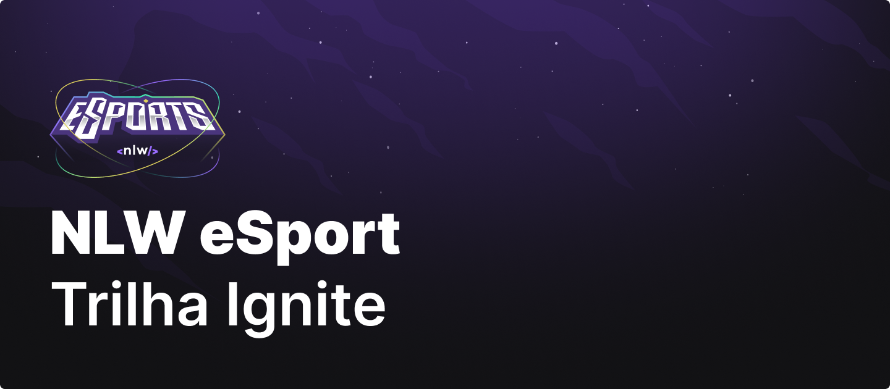
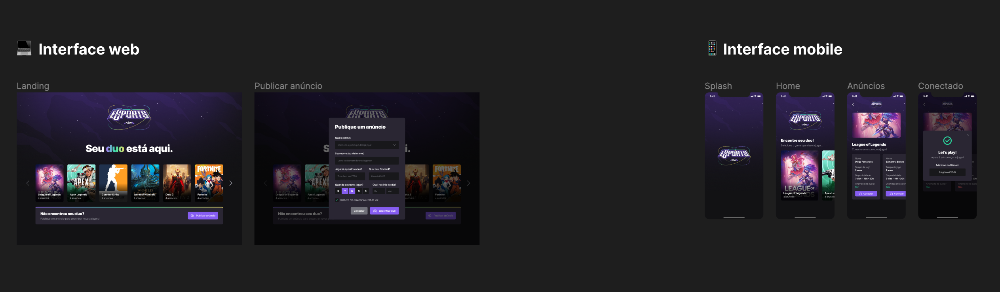
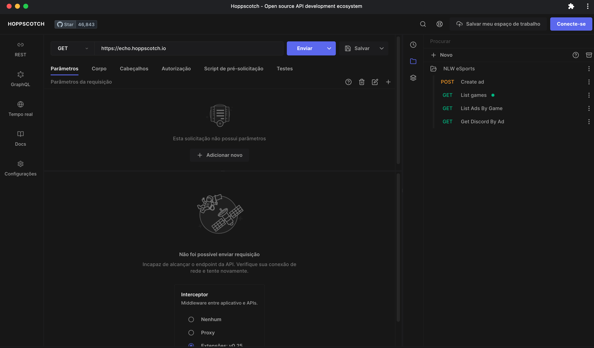

# NLW eSports

Este projeto foi desenvolvido durante o Next Level Week eSports estruturado e apresentado pela [RocketSeat](https://www.rocketseat.com.br).

## 🧑‍🎨 Design

Todo o UI Design foi desenvolvido no Figma e disponibilizado no link a seguir:

[Link para o Figma](https://www.figma.com/file/TYG12SIZtKp3uXvJfwdAbl/NLW-eSports-(Community)?node-id=6%3A23)

---

## 💠 API Backend

Sistema de back-end API desenvolvido utilizando as seguintes tecnologias e bibliotecas:

- Typescript
- Vite
- NodeJS
- Express
- Prisma
- SQLite

## 🎮 Web front-end

Sistema frot-end web desenvolvido utilizando:

- Typescript
- Vite
- ReactJS
- Tailwind CSS
- Radix UI
- Axios
- Phosphor Icons

## 📱 Mobile

Sistema mobile web desenvolvido utilizando:

- Typescript
- ReactNative
- Expo
- Tailwind CSS
- Radix UI
- Axios
- Phosphor Icons
